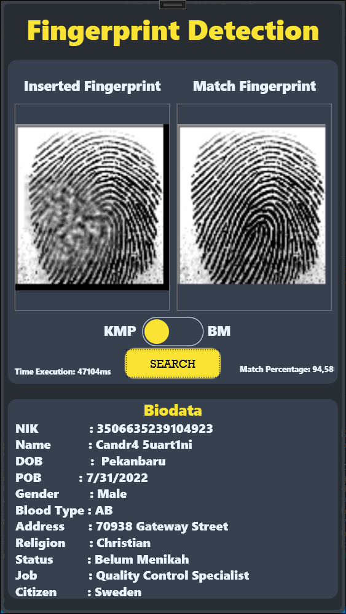

<h1 align="center"> Fingerprint Detection </h1>

<div align="center">
   <br />
</div>

<h2 id = "table-of-contents">🔍 Daftar Isi</h2>
- <a href="#description">Deskripsi</a><br/>
- <a href="#table-of-contents">Daftar Isi</a><br/>
- <a href="#contributor">Kontributor</a><br/>
- <a href="#requirement">Requirement</a><br/>
- <a href="#how-to-run">Cara Penggunaan Program</a>

<h2 id = "description">✨ Deskripsi </h2>

<p align="justify">
    Tugas Besar 03 Strategi Algoritma (IF2211) berbasis graphical user interface (GUI). Program ini adalah aplikasi desktop yang berfungsi untuk mencocokkan sidik jari masukan dengan sidik jari database.Jika sidik jari cocok maka program akan menampilkan biodata pemilik sidik jari tersebut. Pengguna dapat memilih Algoritma mencocokkan sidik jari menggunakan string matching Boyer Moore (BM) dan Knuth-Morris-Pratt (KMP) . 
<p>
<h2 id = "contributor">🌟Kontributor</h2>
<table>
  <tr>
    <th>Nama</th>
    <th>NIM</th>
  </tr>
  <tr>
    <th>Agil Fadillah Sabri</th>
    <th>13522006</th>
  </tr>
  <tr>
    <th>Benjamin Sihombing</th>
    <th>13522054</th>
  </tr>
  <tr>
    <th>Matthew Vladimir Hutabarat</th>
    <th>13522093</th>
  </tr>
</table>

<h2 id="requirement">⚠️ Requirement</h2>

- C# 8.0.300
- WPF
- Visual Studio
- SQLite

<h2 id="lib">📖 WPF Extension Used</h2>

- System.Drawing
- System.IO.Compression
- System.Text.Encodings.Code
- System.Text.Encoding.CodePages


<h2 id="how-to-run">📘 Cara Penggunaan Program</h2>

### Run Program
1. Clone repository ini pada device Anda
git clone https://github.com/NgokNgok04/Tubes3_Bang-Udah-Capek-Bang.git

2. Pastikan device anda sudah mempunyai SQLite3, C#, dan WPF.
3. Masukkan project yang ada yaitu Fingerprint Detection dengan lokasi folder Tubes3_Bang-Udah-Capek-Bang/src/ui/Fingerprint Detection/Fingerprint Detection.
4. Buka WPF dan install extension-extension yang diperlukan dan apply.
5. Build program dengan menekan tombol segitiga hijau pada bagian menu.
6. Masukkan gambar berformat BMP pada kontainer sidik jari.
7. Pilih Algoritma KMP atau BM dengan toogle button yang ada.
8. Mulai pencarian dengan menekan tombol “SEARCH”.
9. Anda dapat melakukan pencarian lagi dengan menekan kontainer “Inserted Fingerprint” lalu pilih gambar yang ingin dicari

### Tambah Dataset
1. Pastikan anda sudah menginstall library Faker
```
 pip install Faker
```
2. Hapus database test.db pada folder Tubes3_Bang-Udah-Capek-Bang/src/ui/Fingerprint Detection/Fingerprint Detection
3. Masukkan gambar dataset yang ingin ditambah ke dalam folder Tubes3_Bang-Udah-Capek-Bang/test. Gambar HARUS berformat fingerprintXXXX dengan XXXX merupakan digit dimulai dari 6001.
Pindah ke direktori Tubes3_Bang-Udah-Capek-Bang/database
4. Seeding ulang dataset dengan menjalankan file db_uhuy dan file db_ahay secara berurutan
5. Masuk ke WPF dan masuk ke menu SQLite Server Compact Toolbox. Klik kanan file test.db dan pilih Remove Connection
6. Lakukan koneksi ulang dengan menekan tombol Add SQLite Connection

7. Pilih Browse dan masukkan file database di direktori Tubes3_Bang-Udah-Capek-Bang/database/test.db